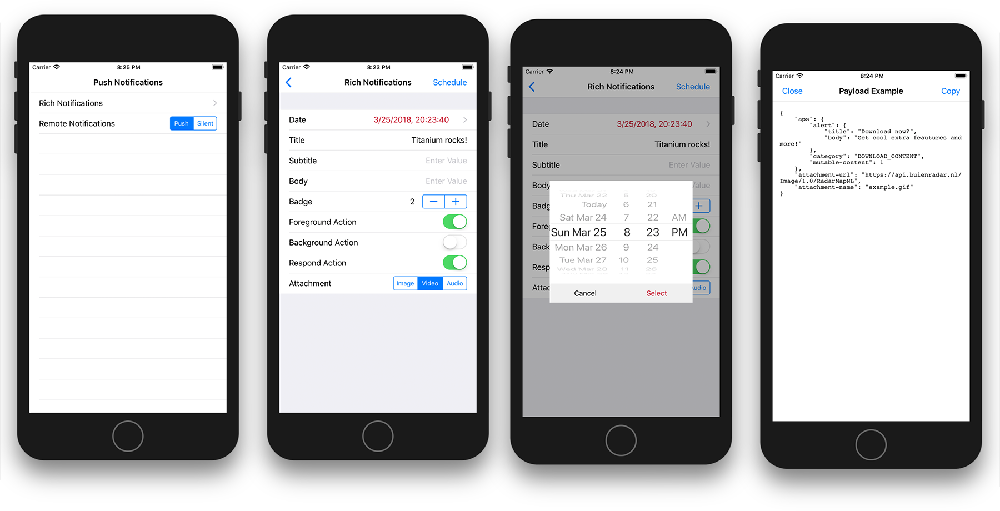

# Titanium iOS Notifications

Using the iOS Notifications API (local, remote, silent & rich) in Titanium, including Swift-based notification extensions!

## Requirements

- 7.3.0 or later (install before GA using `appc ti sdk install -b 7_3_X`

## Features

- [x] Local Notifications
- [x] Remote Push Notifications
- [x] Silent Push Notifications
- [x] Rich Notifications (iOS 10+)

## Notes

Rich Notifications are part of the Titanium SDK 7.3.0 release and includes features like attachments, more configuration
and detailled control over pending notifications. Read more in our updated [Push Notifications Guide](https://wiki.appcelerator.org/display/guides2/Sending+and+Scheduling+Push+Notifications#SendingandSchedulingPushNotifications-RichNotifications(iOS10andlater)).

## License

Apache 2

## Author

[Hans Knöchel](https://github.com/hansemannn) (Axway Appcelerator)
